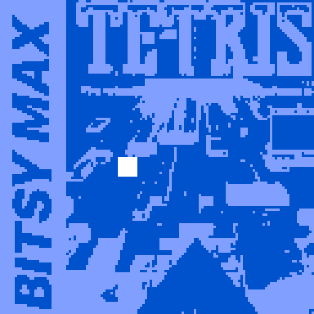

# bitsy-tetris

tetris demake in bitsy engine

uses: bitsy-boilerplate and bitsy-hacks

## how

1. run `npm i`
2. run `npm start` or `npm run build`
   - `start` will watch the input files and rebuild automatically when they're changed
   - `build` will run once
