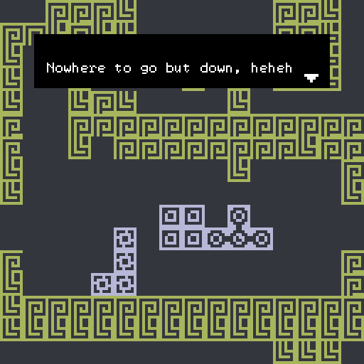
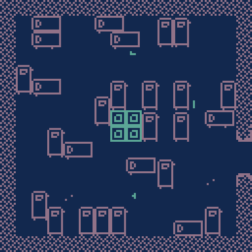

# bitsy-tetris

   Tetris, the classic game, lovingly demade into the 1-bit world of [bitsy](https://ledoux.itch.io/bitsy).

A brand new tetromino-based interactive experience 

play [here](https://maxbittker.github.io/bitsy-tetris/)

uses: bitsy-boilerplate and bitsy-hacks

## how

1. run `npm i`
2. run `npm start` or `npm run build`
   - `start` will watch the input files and rebuild automatically when they're changed
   - `build` will run once
